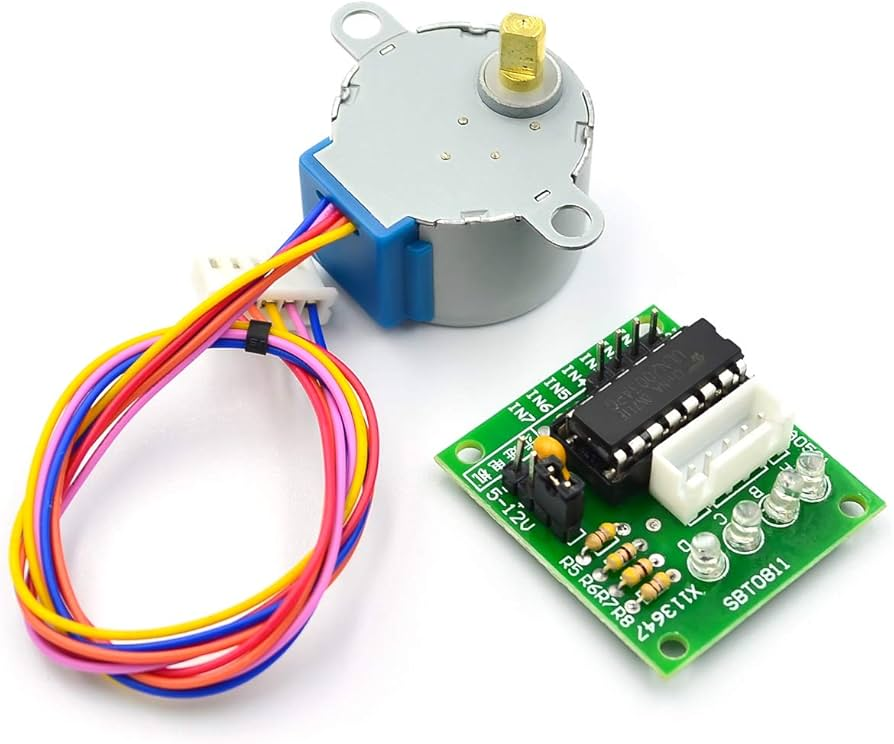
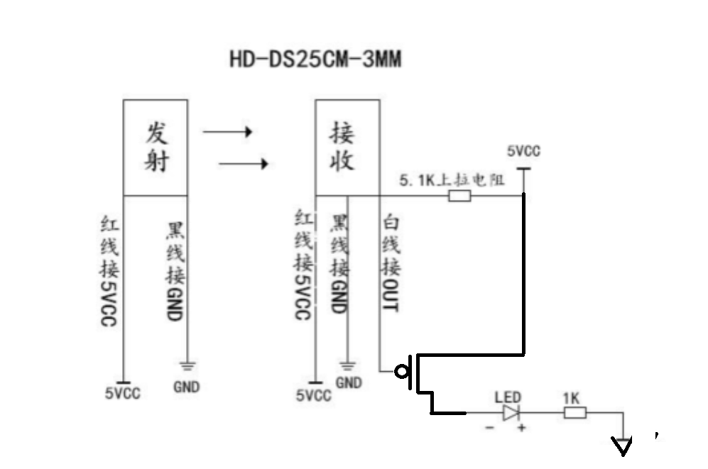
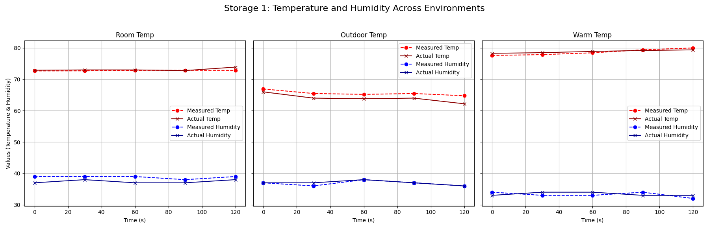

# Milan Patel

## 9-30-2024: Design Document
Worked on design document by revising original project proposal. We have split the product into various subsystems including power, control, despenser, storage, and app. We are working out how to split the work up between different subsystems.

### 10-2-2024
The parts we need to order include stepper motors, step-down converters, temperaure/humidity sensors, IR breakbeam sensors, as well as a development board (and individual ESP32 chips for soldering).

### 10-4-2024
I spoke with the machine shop and let them know about a rough concept for the final product. They have confidence in making a good design since they have experience making similar products in the past. 

The following are some potential parts so we can put an order in soon:
- [5V stepper motor with H-bridge](https://www.amazon.com/ELEGOO-28BYJ-48-ULN2003-Stepper-Arduino/dp/B01CP18J4A/ref=sr_1_4?dib=eyJ2IjoiMSJ9._cXO7sDNRfq3mcO3nu6m5Y9s3FcVqeNc5vRjBHfDyKyOFRHFTYoTIkqXXlUh71AI_zSQzbHnD3gQWpnFrEw0ZneWP3WoYirsnF4yLbr8oNJJIZs8cJTKsYzsk8GxGYX47WCCE_KmDV-2wJEfCzovzNqFCdjDXT48PQID_8a87XbfGW9a3DPswnj-ER1OfqNFxJT0IuF5KAQxJU223i05nH2KA-4UknKsQ4eqZqgkCTjzuIUd9Tb_IwZTkcmA7Fng2d_PFnjBVGuiVAhSO7q0TFVIzVdoMNSK3uEo0LOIEaQ.qoC84We7RLCtzhQLbcsl_eM0E0XRRXxyzDIcu6lQP1M&dib_tag=se&keywords=5v+stepper+motor&qid=1729717164&s=industrial&sr=1-4)
- [Temperature/humidity sensors](https://www.amazon.com/HiLetgo-Temperature-Humidity-Digital-3-3V-5V/dp/B01DKC2GQ0/ref=sr_1_6?crid=MYLMCJVSO6BK&dib=eyJ2IjoiMSJ9.ff81rkIhx79UxBpuJfSw7D4Yuj6-fdP_dnBn9cqrzGmJDj5hwjcqt6FKeIMHbfraZJhoa84o0lNQbbsLKrDeBUqn2xhq5ClCfFK1zOqW4JYwIFL9xbeIZZyS-wJuwQjp_OupEY44gkxM48jKgLRVOhEniWzVRNFd9erojO9p5s4hi5auWREsqqbAs9Ryi4LG37cnmuonOGTbXdIvAZogNRJIuaMWKBirwWr8NC9VJRFPBmo3RMn0Lv6YFwxuzbtJ2Itmx1oIw898Q1LqkPDVCnefy7fvcBMeg3Aw58aSa8Q.R9SSDKNCe-LqT8hGVJJr1MGBtFwavA9PvcueFoz53W8&dib_tag=se&keywords=temperature+humidity+sensor&qid=1729717217&s=industrial&sprefix=temperature+humidity+sensor%2Cindustrial%2C127&sr=1-6)
- [IR breakbeam sensors](https://www.adafruit.com/product/2167)

## 10-7-2024: Design Review & Feedback
We had our design document reviewed by some TAs and a professor. The feedback we got mainly had to do with our dispensing and power subsystems.

Power subsystem feedback:
- How are we going to step down 12V from a wall outlet to 3.3V and 5V respecitvely? 
- They are both large drops so would we use some sort of heat dissipation?
  
Power subsystem ideas: We realize that stepping down from 12V to 3.3V and 5V is a fairly large drop. However, we have looked into what other groups have done and spoken with our TA. We are going to move forward and use two separate step-down circuits. This way we avoid running the risk of overheating or frying any components.

### 10-9-2024
Dispensing subsystem feedback:
- What is the point of having a load sensor if each rotation will output a fixed amount of tea leaves?
- How are we going to address the issue of the load sensor needing time to update before we do additional rotations for motors?
  
Dispenser subsystem ideas: The point of the load sensor is to help get real-time feedback for what the motors have dispensed. We will most likely need to crush up the tea leaves to a fine powder in order to make sure that the motors can dispense them. This isn't ideal but it is very difficult to have the product scoop whole dry leaves. We think it will still be useful in the end since some teas (like matcha) are best prepared in this powder form. Also, we will make sure to have delays between when the dispenser motors rotate and when the load sensor gets a new reading. This will ensure that we are actually using the data to record accuracy as well as not go too far over what the user requested.

## 10-14-2024: First Round PCB Order
Unforunately, we missed the first round but are not too worried since we were still in the process of determining parts. We still created a rough sketch in KiCad but had a few questions.

### 10-16-2024
The ESP example used on the class wiki is the S3-WROOM. The development kit we got is for the 32D. We were unsure if there are issues with testing on one and actually soldering a different one. We are going to move forward with testing using the 32D and changing the GPIO pin values in the code when we actually solder on the S3-WROOM. Looking into the differences, we found that one has more flash memory and cores, and provides additional pins.

[ESP32-WROOM-32D Development Kit](https://www.amazon.com/ESP-WROOM-32-Development-Microcontroller-Integrated-Compatible/dp/B07WCG1PLV/ref=asc_df_B08D5ZD528/?tag=hyprod-20&linkCode=df0&hvadid=704452679949&hvpos=&hvnetw=g&hvrand=7852350028347149581&hvpone=&hvptwo=&hvqmt=&hvdev=c&hvdvcmdl=&hvlocint=&hvlocphy=9022196&hvtargid=pla-1482925280865&mcid=b19b3528a2fd37a79f59026acab65ca1&th=1)

[ESP32-S3-WROOM-1 Chip](https://www.digikey.com/en/products/detail/espressif-systems/ESP32-S3-WROOM-1-N4/16163950?utm_adgroup=&utm_source=google&utm_medium=cpc&utm_campaign=PMax%20Shopping_Product_Medium%20ROAS%20Categories&utm_term=&utm_content=&utm_id=go_cmp-20223376311_adg-_ad-__dev-c_ext-_prd-16163950_sig-Cj0KCQjwveK4BhD4ARIsAKy6pMIonoYtQatlQC2NjCjf0gKEAzba1Vu4lBjE7WjG_tXlET55FAkn6aIaAjfbEALw_wcB&gad_source=1&gclid=Cj0KCQjwveK4BhD4ARIsAKy6pMIonoYtQatlQC2NjCjf0gKEAzba1Vu4lBjE7WjG_tXlET55FAkn6aIaAjfbEALw_wcB)

Both of these offer wifi capabilites which will work well for our user interface that triggers the dispensing. 

## 10-21-2024: Machine Shop & Second Round PCB Order
We were able to get in an order for the second round PCB's. We are somewhat confident but had questions regarding the power circut. We also only included 1 of each sensor/motor so we can start small and add in the rest for the PCB order next week.

We still need to get connectors, resistors, and capacitors in order to solder them on next week. Meanwhile, we are continuing to look into testing each subsystem individually. The motors work but we may have an issue with the torque they provide. At 5V, the motors seem to turn pretty slowly. We can easily adjust our schematic and instead use an adjustable output for the 12V step-down converter. However, we need to keep the current issue in mind. When testing with 5V, a single motor seemed to draw in about 250mA. If we have 3, it will be 750mA. If we decide we need to increase the power, this current amount will only increase. This is something we need to make sure is reflected using circuits to dissipate some of that extra current as well as with track sizes that support larger current flow.

### 10-23-2024
The machine shop was expecting a smaller temperature/humidity sensor but they should be able to drill holes in the back of thed design and have the sensors poke through. As for the IR sensors, they were not here on time so we had to place a special order to make sure they will be here as soon as possible. The shop will not move forward with any changes to what they have until they get those parts. Once that comes in, we should be able to have that completed within a week. Then, we can start testing. The attachments for the motors look quite bulky so the issue of torque will most likely be something we need to address.

IR Sensors: We will need to include a pull-up resistor (10K) for the receiver if we want to read a digitial signal off the wires. This is a datasheet that shows an example circuit for the receiver: 
- [IR sensor datasheet](https://cdn-shop.adafruit.com/product-files/2167/C2916.pdf)
- [IR sensor circuit](https://www.youtube.com/watch?v=GWdDeB7Sltw)

### 10-25-2024
Since the sensors will be pretty close to one another, we are going to try making it work using 3.3V instead of 5V. Using 5V would make it so that the motors drawing current can potentially short out the breakbeam sensors since they will be connceted using the same track.

## 10-28-2024: Developing Code for Motors
I started looking into implementing a class to capture motor control. The motors we are using can operate at 5V to 12V and require four enable connections to the ESP32. I think that current will be something to pay close attention to since 5V will almost certainly not be enough to overcome friction. The machine shop was able to embed the correct motors so now we are able to use the H-bridges that came with the stepper motors.

### 10-29-2024
I was able to manually test a single motor by having the code rotate it clockwise and then counterclockwise. There was a delay between the two rotations. At 5V, the motor pulls in about 250 mA. Visually, I can see it rotating quite slowly. There is a parameter that sets the speed of the motor and can go up to roughly 500 before it stops working. The Arduino Stepper.h library is super useful with abstracting away the sequences required to rotate a four-wire stepper motor.



### 11-1-2024
Moving forward, I need to pay close attention to how many GPIO pins are available since we have three motors. This requires 12 GPIO connections that support both output and input. I spoke with the TA and they said it is safe to use a breakout board instead of making it from scratch. These boards simply implement a driver through a ULN2003 chip. We could have soldered this ourselves but it is a simple connection. Using the board given is valid.

## 11-4-2024: ESP32 Wifi Server
I started looking into the Wifi capabilities of the ESP32 development board we are using. There is a lot available online in terms of resources for utilizing a web server through the ESP32. I was able to create a basic HTML page that lets me turn two LEDs on and off. From here, I was able to develop an outline for readings requests from the HTML page for rotating motors, dispensing specific amounts of tea, and displaying temperature/humidity reading values. The one issue I ran into is that the Wifi network in the lab (and other UIUC buildings) is not as simple as a password and SSID. We are onlt able to connect to the campus Wifi using our Illinois net id's. There was very little information online for connecting ESP32's to campus Wifi. I chose to go a different route and connect to my iPhone hotspot instead. However, this was extremely slow on my computer and only worked if I opened up the HTML page on my phone. This shouldn't be an issue for demo. For practical use, users would simply be able to connect to their home Wifi which should just require a network name and password, unlike our campus network.

[Webserver example](https://randomnerdtutorials.com/esp32-web-server-arduino-ide/)

### 11-7-2024
The time it takes to connect to a valid network is fairly quick. I was able to take temperature/humidity readings and display them on the page. The only issue is that the page needs to be refreshed to get new readings. I have it updating every 5 seconds. The user would just need to refresh the page themselves. I may look into XML to update the page in real time and improve the organization of the code. Right now, all the HTML javascript lies in the same file that does a lot of the main tea maker logic.

## 11-11-2024: Mock Demo Preparations
I spent some of this week updating the block diagram. Some of the original plans we had were altered. Specifically, the motors now require an individual motor driver and four input lines from the microcontroller. 


We also realized that we need to use two separate power sources for the motors and rest of the circuit. This is beacuse Kyle realized that stepping down from 12V to 5V can be a large jump. The heat given off would be large so we decided to instead have a separate 5V source from the wall adapter and step this down to 3.3V. He has been updating the schematic as needed and got the final round PCB order in. This is the one that will hopefully be used in our final design. 

### 11-14-2024
I also spent most of this week getting the application to a working state that we can show our TA during the mock demo. I want to highlight that each subsystem works independently. I had a few questions regarding what to do about the load sensor being so inaccurate when working with smaller amounts of weight. 

## 11-18-2024: Mock Demo & Load Sensor
This week we had the mock demo. It went well and our TA feels confident that we will be able to get to a final working state by the final demo. The one issue that I wanted addressed was what to do about the load sensor not always picking up small changes in weight. Our TA mentioned that we have a few options when it comes to this.

Load sensor feedback:
- Find the average weight that a single rotation dispenses and, if the new weight is less than the previous, simply add the average instead of taking the new reading
- Troubleshoot the load sensor and try reducing incoming noise to make the readings more accurate
- Take more readings and keep taking them until a higher weight is registered. Use this higher weight

### 11-20-2024
I decided to go with the first solution and tweaked it a bit as well. I only ever added a small amount after taking more readings and averaging them. This ensures that I am still taking the actual load sensor reading into account. 

## 11-25-2024: Testing & Verifications
I spent this week combing the finishing touches on the design with testing and verifications for various subsystems. I needed to find a way to cover the device to hide any wires while still allowing easy access for USB/power connections. I used a box and covered it in wallpaper that matched the color of the wood.

### 11-27-2024
Control Subsystem Testing:
- Requirement 1: Must be able to send and receive signals from temperature, humidity, and IR sensors
- Verification 1: I implemented code that helped send signals form specific GPIO pins connected to each of the sensors being tested. 
 ```Cpp
#include "DHT.h"
#include "HardwareSerial.h"
#include "storage.h"
#define DHTTYPE DHT11

storageCell::storageCell(stepperMotor _storageMotor, int _tempHumidityPin)
                            : storageMotor(_storageMotor), tempHumiditySensor(_tempHumidityPin, DHTTYPE){
  Serial.println("New storage motor initialized!");
  tempHumiditySensor.begin();
  Serial.println("New temperature/humidity sensor initialized!");
}

float storageCell::get_temperature(){
  return tempHumiditySensor.readTemperature(true);
}

float storageCell::get_humidity(){
  return tempHumiditySensor.readHumidity();
}
 ```               

Here, I used the DHT11 temperature sensors mentioned before and the DHT.h library. This used built-in functions to read the raw value of the reading and convert it to a digital one. This verification was straightforward since I basically checked if the value returned was some numerical value. The IR sensors were connected to a simple circuit where an LED would light up if the beam was broken. 



This verification was simple as well since I checked wether or not the LED lit up when there was something obstructing the path between the transmitter and receiver. 

### 11-29-2024
- Requirement 2: Must be able to send pulse signals to the motor driver to control stepper motors.
- Verification 2: I implemented code that would rotate motors a specified number of steps and allow users to step them as well from the app.
```Cpp
#include <Stepper.h>
void stepperMotor::stepClockwise(int steps){
  Serial.print("Spinning motor clockwise! ");
  if(steps == 0){
    dispensingStepper.step(stepsPerRevolution);
    Serial.printf("(%d times)\n", stepsPerRevolution);
  }
  // This is a new rotation request, so set the corresponding variables accordingly
  else if (stepsRemaining == -1){
    stepsRequested = steps;
    stepsRemaining = steps;
    if (stepsRemaining > stepIncrementSize) {
      dispensingStepper.step(stepIncrementSize);
      stepsRemaining -= stepIncrementSize;
    }
    else {
      dispensingStepper.step(stepsRemaining);
      stepsRequested = -1;
      stepsRemaining = -1;
      Serial.println("Motor stepping complete!");
      motorRotationRequested = false;
      disableMotor();//testing
    }
  }
  // A previous rotation was requested, so make the necessary number of steps 
  else{
    if (stepsRemaining > stepIncrementSize) {
      dispensingStepper.step(stepIncrementSize);
      stepsRemaining -= stepIncrementSize;
    }
    else {
      dispensingStepper.step(stepsRemaining);
      stepsRequested = -1;
      stepsRemaining = -1;
      Serial.println("Motor stepping complete!");
      motorRotationRequested = false;
      disableMotor();//testing
    }
  }
}
```
This code utilizes the Stepper.h library with its built-in functions. Stepper motors require the enable to lines to receive HIGH and LOW signals in a specific sequence to drive the motors. When one of the four enable lines is sent a HIGH signal, the circuit is connected within the driver. Once connected, the 12V source is allowed to flow to that line on the motor which heats up one of the ends on one of the coils inside. When these two coils are heated up in a specific sequence, the motor can rotate a single steps. If this is repeated some number of times, the motor will rotate that number of steps. In order to allow users to stop the motor when they wish, I decided to step the motor five steps at a time. This allows the program to check if a request to stop the motor was received.

### 11-30-2024
App Subsystem Testing:
- Requirement: Must be able to process requests from the app in less than 2 seconds
- Verification: This was fairly simple to ensure. I added an extra check when receiveing a request which checks if the time between the client (app/smartphone/computer) connecting and the request being received is less than 2 seconds. This timeout ensures that the request can only be processed if it is received shortly after a new client connects. Each time a request is processed, the client then disconnects. This scales up to show that every singler request must reach the server (ESP32 web server) in less than 2 seconds.

Storage Subsystem Testing:
- Requirement 1: Must be able to send accurate readings for temperature/humidity sensors, ranging from 72-77 F and 30-50%
- Verification 1: I performed three experiments per storage cell. I took temperature and humidity readings in a room temperature, warmer temperature, and colder temperature environment. I used the app to take sensor readings and used a commercial product to take the actual readings. I then organized this information into a grap and checked if the percent errors of 2% for temerature and 5% for humidity were met. 



I also put this into tables to show the actual readings and percent errors.

### Storage Cell Subsystem

#### Storage Conditions
Room Temperature:
| Time After Test Started (sec) | Storage #1 Temperature (F) Meas. | Storage #1 Temperature (F)Real | Storage #1 Humidity (%) Meas. | Storage #1 Humidity (%) Real | Storage #2 Temperature (F) Meas. | Storage #2 Temperature (F) Real | Storage #2 Humidity (%) Meas. | Storage #2 Humidity (%) Real | Storage #3 Temperature (F) Meas. | Storage #3 Temperature (F) Real | Storage #3 Humidity (%) Meas. | Storage #3 Humidity (%) Real |
|-------------------------------|-----------------------------------|----------------------------------|-------------------------------|-------------------------------|----------------------------------|----------------------------------|-------------------------------|-------------------------------|----------------------------------|----------------------------------|-------------------------------|-------------------------------|
| 0                             | 72.68                            | 72.9                             | 39                            | 37                            | 72.68                            | 72.9                             | 34                            | 37                            | 73.40                            | 73.9                             | 38                            | 37                            |
| 30                            | 72.70                            | 73.0                             | 39                            | 38                            | 72.72                            | 72.0                             | 36                            | 38                            | 72.88                            | 73.0                             | 38                            | 38                            |
| 60                            | 72.86                            | 73.0                             | 39                            | 37                            | 72.68                            | 73.0                             | 36                            | 37                            | 73.40                            | 73.0                             | 38                            | 37                            |
| 90                            | 72.88                            | 72.8                             | 38                            | 37                            | 72.86                            | 72.8                             | 37                            | 37                            | 73.40                            | 72.8                             | 37                            | 37                            |
| 120                           | 72.86                            | 73.9                             | 39                            | 38                            | 72.68                            | 72.9                             | 35                            | 38                            | 73.44                            | 73.9                             | 38                            | 38                            |

| Time After Test Started (sec) | Storage #1 Temperature Error (%) | Storage #1 Humidity Difference (%) | Storage #2 Temperature Error (%) | Storage #2 Humidity Difference (%) | Storage #3 Temperature Error (%) | Storage #3 Humidity Difference (%) |
|-------------------------------|-----------------------------------|------------------------------------|-----------------------------------|------------------------------------|-----------------------------------|------------------------------------|
| 0                             | 1.39%                            | 2%                                 | 0.30%                            | 3%                                 | 0.68%                            | 1%                                 |
| 30                            | 0.74%                            | 1%                                 | 1.00%                            | 2%                                 | 0.16%                            | 0%                                 |
| 60                            | 0.62%                            | 2%                                 | 0.44%                            | 1%                                 | 0.55%                            | 1%                                 |
| 90                            | 0.74%                            | 1%                                 | 0.08%                            | 0%                                 | 0.82%                            | 0%                                 |
| 120                           | 0.87%                            | 1%                                 | 1.65%                            | 3%                                 | 0.62%                            | 0%                                 |

Colder Temperature:
| Time After Test Started (sec) | Storage #1 Temperature (F) Meas. | Storage #1 Temperature (F) Real | Storage #1 Humidity (%) Meas. | Storage #1 Humidity (%) Real | Storage #2 Temperature (F) Meas. | Storage #2 Temperature (F) Real | Storage #2 Humidity (%) Meas. | Storage #2 Humidity (%) Real | Storage #3 Temperature (F) Meas. | Storage #3 Temperature (F) Real | Storage #3 Humidity (%) Meas. | Storage #3 Humidity (%) Real |
|-------------------------------|-----------------------------------|----------------------------------|-------------------------------|-------------------------------|----------------------------------|----------------------------------|-------------------------------|-------------------------------|----------------------------------|----------------------------------|-------------------------------|-------------------------------|
| 0                             | 66.92                            | 66.0                             | 37                            | 37                            | 66.92                            | 66.0                             | 34                            | 37                            | 66.92                            | 66.0                             | 38                            | 37                            |
| 30                            | 65.48                            | 65.0                             | 36                            | 37                            | 65.48                            | 64.0                             | 35                            | 37                            | 65.48                            | 65.0                             | 37                            | 37                            |
| 60                            | 65.20                            | 64.8                             | 38                            | 38                            | 65.32                            | 63.8                             | 36                            | 38                            | 65.20                            | 64.8                             | 37                            | 38                            |
| 90                            | 65.48                            | 65.0                             | 37                            | 37                            | 66.20                            | 64.0                             | 36                            | 37                            | 65.48                            | 65.0                             | 37                            | 37                            |
| 120                           | 64.76                            | 64.2                             | 36                            | 36                            | 64.80                            | 62.2                             | 36                            | 36                            | 64.76                            | 64.2                             | 38                            | 36                            |

| Time After Test Started (sec) | Storage #1 Temperature Error (%) | Storage #1 Humidity Difference (%) | Storage #2 Temperature Error (%) | Storage #2 Humidity Difference (%) | Storage #3 Temperature Error (%) | Storage #3 Humidity Difference (%) |
|-------------------------------|-----------------------------------|------------------------------------|-----------------------------------|------------------------------------|-----------------------------------|------------------------------------|
| 0                             | 0.30%                            | 0%                                 | 0.30%                            | 3%                                 | 1.39%                            | 1%                                 |
| 30                            | 0.41%                            | 1%                                 | 0.38%                            | 2%                                 | 0.74%                            | 0%                                 |
| 60                            | 0.19%                            | 0%                                 | 0.44%                            | 2%                                 | 0.62%                            | 1%                                 |
| 90                            | 0.11%                            | 0%                                 | 0.08%                            | 1%                                 | 0.74%                            | 0%                                 |
| 120                           | 1.41%                            | 0%                                 | 1.65%                            | 0%                                 | 0.87%                            | 2%                                 |

Warmer Temperature: 
| Time After Test Started (sec) | Storage #1 Temperature (F) Meas. | Storage #1 Temperature (F) Real | Storage #1 Humidity (%) Meas. | Storage #1 Humidity (%) Real | Storage #2 Temperature (F) Meas. | Storage #2 Temperature (F) Real | Storage #2 Humidity (%) Meas. | Storage #2 Humidity (%) Real | Storage #3 Temperature (F) Meas. | Storage #3 Temperature (F) Real | Storage #3 Humidity (%) Meas. | Storage #3 Humidity (%) Real |
|-------------------------------|-----------------------------------|----------------------------------|-------------------------------|-------------------------------|----------------------------------|----------------------------------|-------------------------------|-------------------------------|----------------------------------|----------------------------------|-------------------------------|-------------------------------|
| 0                             | 77.62                            | 78.3                             | 34                            | 33                            | 77.88                            | 77.3                             | 34                            | 33                            | 78.42                            | 78.3                             | 34                            | 33                            |
| 30                            | 77.88                            | 77.5                             | 33                            | 34                            | 77.96                            | 77.5                             | 35                            | 34                            | 78.88                            | 78.5                             | 34                            | 34                            |
| 60                            | 78.46                            | 78.9                             | 33                            | 34                            | 78.52                            | 78.9                             | 32                            | 34                            | 79.24                            | 78.9                             | 32                            | 34                            |
| 90                            | 79.42                            | 79.2                             | 34                            | 33                            | 79.16                            | 79.2                             | 33                            | 33                            | 79.68                            | 79.2                             | 33                            | 33                            |
| 120                           | 80.00                            | 79.4                             | 32                            | 33                            | 79.82                            | 79.4                             | 34                            | 33                            | 79.92                            | 79.4                             | 34                            | 33                            |

| Time After Test Started (sec) | Storage #1 Temperature Error (%) | Storage #1 Humidity Difference (%) | Storage #2 Temperature Error (%) | Storage #2 Humidity Difference (%) | Storage #3 Temperature Error (%) | Storage #3 Humidity Difference (%) |
|-------------------------------|-----------------------------------|------------------------------------|-----------------------------------|------------------------------------|-----------------------------------|------------------------------------|
| 0                             | 1.39%                            | 1%                                 | 0.75%                            | 1%                                 | 0.15%                            | 1%                                 |
| 30                            | 0.74%                            | 1%                                 | 0.59%                            | 1%                                 | 0.48%                            | 0%                                 |
| 60                            | 0.62%                            | 1%                                 | 0.48%                            | 2%                                 | 0.43%                            | 2%                                 |
| 90                            | 0.74%                            | 1%                                 | 0.05%                            | 0%                                 | 0.61%                            | 0%                                 |
| 120                           | 0.87%                            | 1%                                 | 0.53%                            | 1%                                 | 0.66%                            | 1%                                 |

## 12-2-2024: Final Demo & Mock Presentation
This week, we had our final demo. It went as we expected. We were unfortunately not able to get the PCB working in time. We had to pivot to using the breadboard design that I had finalized over Thanksgiving Break. We had an issue connecting to the service in the demo room which would have made our entire project fail. Thankfully, it ended up connected barely and allowed us to move through the subsystems and show the professor and audience. I am happy with how we were able to combine our contributions. Kyle tried his best to get the PCB last second integrated, but we simply did not have enough time. Tanmay added some of his design choices to the app which made it more of a final product instead of a testing application. 

### 12-4-2024
For the future, there are a lot of things I think we can improve with the design. I would love to get the PCB integrated to show that our design doesn't rely on a breadboard to function. The app could be converted to an asynchronous model instead so that users do not need to constantly refresh the page to see changes reflected. Also, I think the tea getting stuck sometimes was our main issue. I would try coming up with a more reliable way to rotate the motors and not have them jam up with the tea. Having some sort of additional filtering process to send the leaves through in smaller amounts to the motors may have helped.